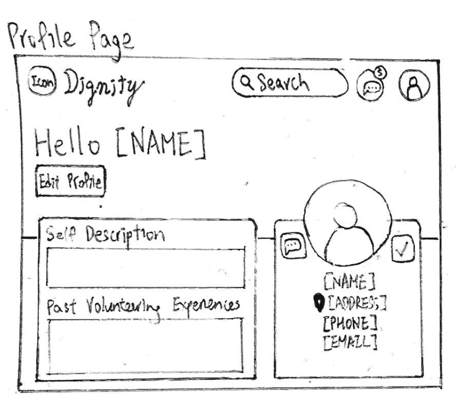
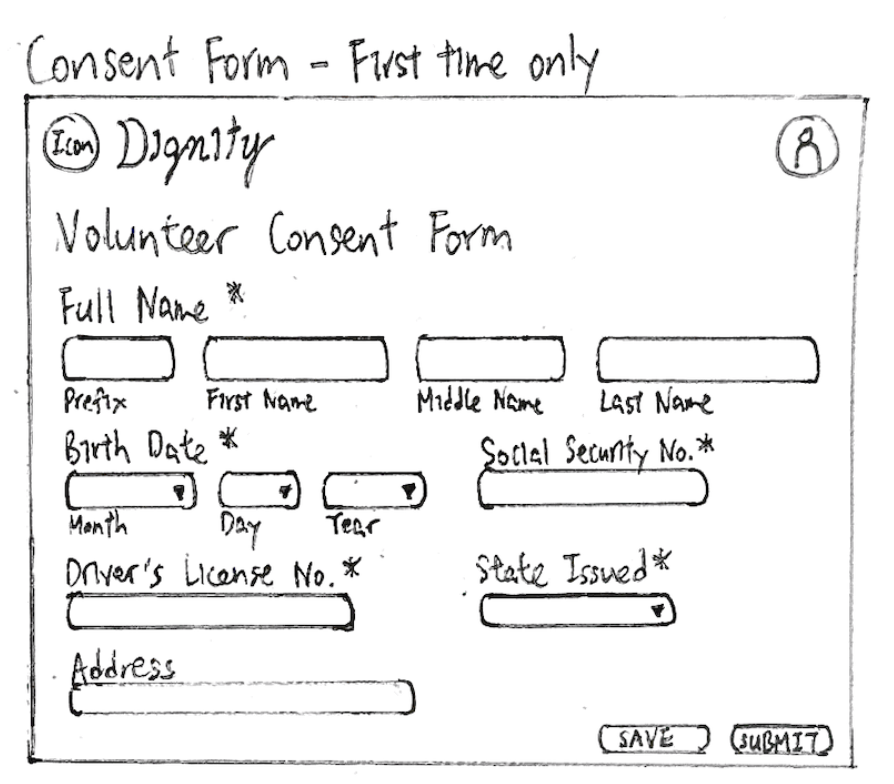
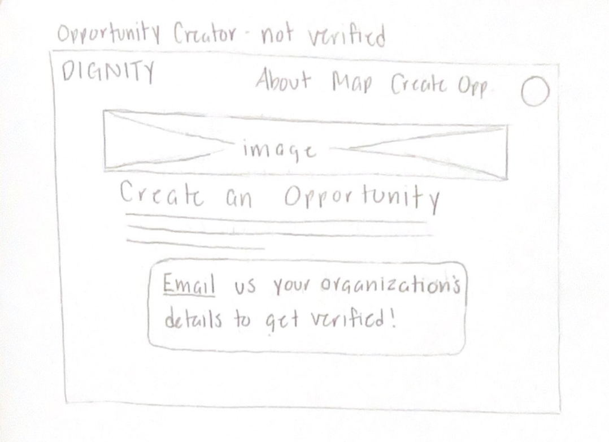
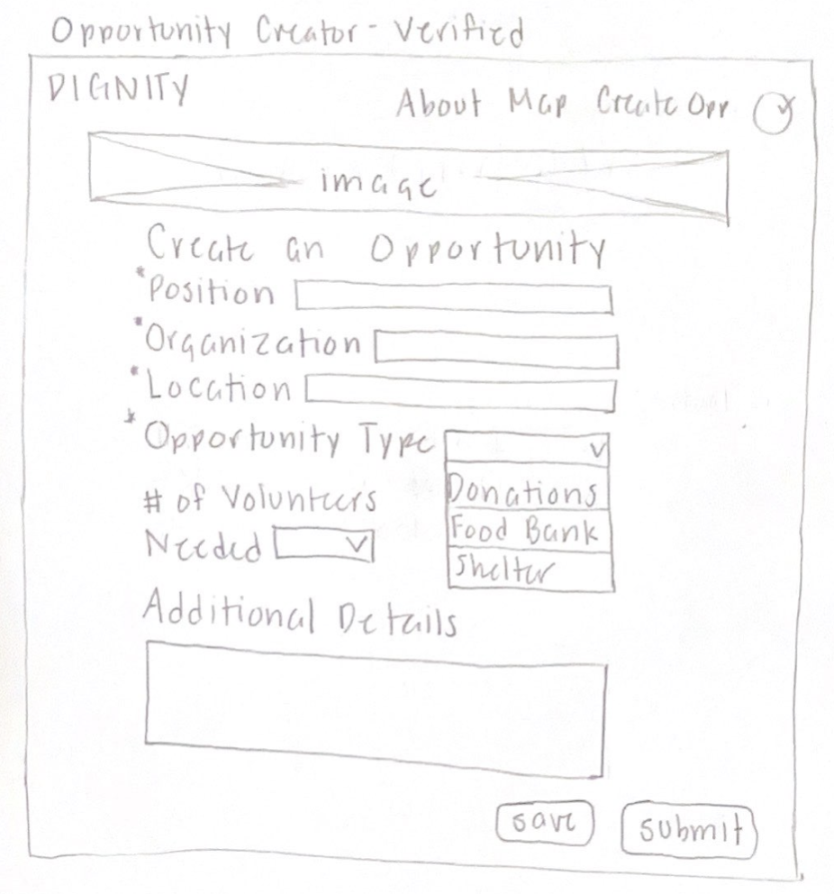
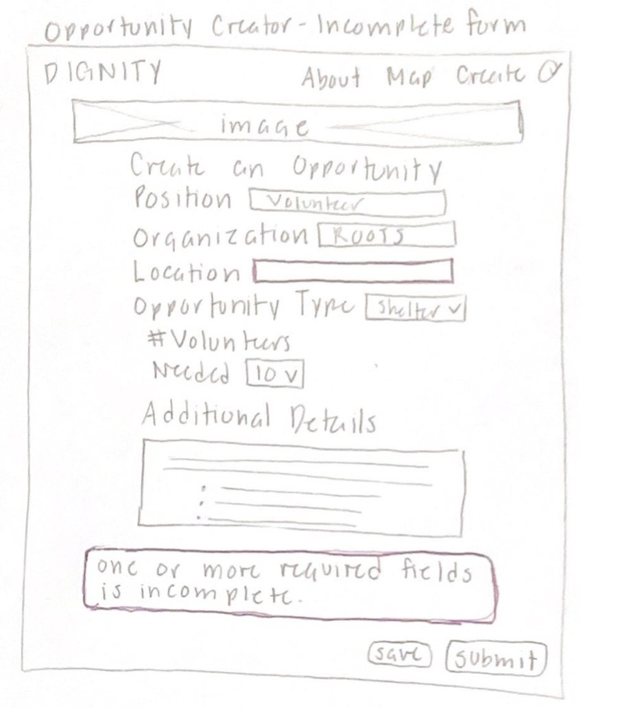

# Dignity Specifications

## Problem Statement
Seattle’s growing homeless population has been a topic of concern for years, with driving factors including mental illness, drug use, poverty, weather, and low-income mobility. In 2022, At least 53,500 people experienced homelessness, a stark increase from 45,300 people during 2019, according to the King County Regional Homelessness Authority. The 2022 Annual Homelessness Assessment Report (AHAR) reported that more than 70% of this growth came from Seattle and King County. To ensure the fourth largest homeless population in the U.S. receives the support they need, help just as large must be mobilized to combat the extent of Seattle’s homelessness problem.

The impacts of homelessness in Seattle can be seen by simply walking around downtown or driving along the highways that run through the city, where tents and makeshift shelters are visible on the sides of the road. ROOTS Young Adult Shelter reports that young adults experiencing homelessness have intensified health risks, as they are still developing physically, mentally, emotionally, and cognitively. The extreme stress along with the health risks homeless people face can lead to the use of drugs to cope with their difficult situations. Without any support, homeless people are significantly more likely to experience chronic homelessness, illustrating the homeless population’s urgent need for support to prevent them from experiencing an endless cycle of homelessness.

According to the UN, Europe and Northern America are driving the decline in the labor income share. Despite this decline, housing costs are seeing significant price increases. The Washington Office of Financial Management reports that within one year, home prices in Washington grew 23.9% from 2020 to 2021, and in the last decade, home costs more than doubled from $223,900 in 2011 to $560,400 in 2021. This increase in rental and housing costs, paired with a decline in labor income share, is said to be the major driver of the increase in homelessness statewide according to Tedd Kelleher, housing policy director for the Washington Department of Commerce. 

The City of Seattle’s policy framework for addressing homelessness is listed on their website as: person-centered service model, invest in programs that connect people to housing, and address racial disparities. Their Homeless Services System has three primary investment areas: prevention, emergency, and housing. While these are good ideas to work towards, they remain as ideas. The effects of these policies are not visible - the increase in Seattle’s homeless population each year shows that more needs to be done to help provide support for these people. We can start addressing the problem by increasing awareness of opportunities and decreasing barriers to help the homeless population. By mobilizing more people to volunteer towards existing solutions, they will be able to help more homeless people combat chronic homelessness, serving as a stepping stone for more permanent solutions to emerge.

**Citations:**

“Addressing Homelessness.” Addressing Homelessness - Human Services, www.seattle.gov/human-services/reports-and-data/addressing-homelessness#:~:text=Who%20is%20experiencing%20homelessness%20in,compared%20to%20the%202019%20Count. Accessed 23 June 2023.  
“HUD Releases 2022 Annual Homeless Assessment Report.” HUD.Gov / U.S. Department of Housing and Urban Development (HUD), 19 Dec. 2022, www.hud.gov/press/press_releases_media_advisories/HUD_No_22_253.  
Patrick, Anna. “WA’s Homeless Population Is Increasing, New HUD Report Shows.” The Seattle Times, 28 Mar. 2023, www.seattletimes.com/seattle-news/homeless/was-homeless-population-is-increasing-new-hud-report-shows/.  
“SDG Indicators.” United Nations, unstats.un.org/sdgs/report/2022/Goal-01/. Accessed 23 June 2023.  
“Why Are Young People Homeless?” ROOTS Young Adult Shelter, rootsinfo.org/young-adult-homelessness. Accessed 23 June 2023. 

## Solution Summary
This application will enable people to help the homeless population in King County by increasing awareness and decreasing barriers to opportunities. Various volunteer locations will be presented through an interactive map, which the user can filter to find and sign up for specific opportunities. These volunteer opportunities will be posted by homeless shelters, food banks, and other organizations to recruit help. Additionally, information about these opportunities will be included to further encourage people to sign up, including what kind of help is needed and how many volunteers are needed.

## Design

### Home Page

[insert wireframes]

Interaction Details:

### Opportunity Map Page

1. Map is zoomable and pannable
2. Filter tab in top right corner, can be toggled to be hidden
3. Filter tab includes togglable filter symbols representing location / opportunity types: donation center, food bank, and soup kitchen + in person and virtual
4. Filter tab expands to show available opportunities; clicking on the opportunity zooms to the location on the map and includes more details + link to directions
5. User can also click on locations represented by color coded dots instead of filtering

### Profile Page

Interaction Details:
1. User can click on the edit profile button to edit their information
2. User can fill out online waiver form and either save for later or submit for organizations to see

### Opportunity Creator Page

Interaction Details:
1. If user is not verified to create opportunities, can click on email to contact us through email to get verified.
2. User can fill out the form and click on either save for later or submit buttons
3. If user submits form with one of the required fields incomplete, a pop-up detailing the incomplete form is shown in red.
